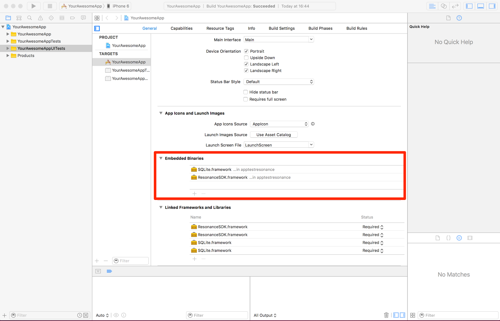
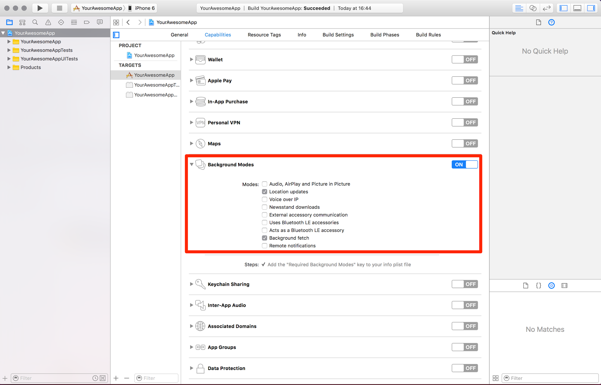

.. _iosstart:

Resonance iOS SDK framework
================================

This part of documentation is intended to get you up and running with the Resonance iOS SDK framework.
We’ll walk through from setup to running your own Resonance-Powered-App.

Add the SDK to your Xcode Project
--------------------------------

To add the SDK in Xcode:
* Drag the ResonanceSDK.framework and SQLite.framework to Frameworks in Project Navigator. Create a new group Frameworks if it does not exist.
* Choose “Create groups for any added folders”.
* Select “Copy items into destination group's folder” so you’ll keep the framework directly in your project and repository.
* Be sure to add both frameworks in the Embedded Binaries section of Xcode. You can find the section in the your target General tab. View Screenshot for reference

Configure the app capabilities
^^^^^^^^^^^^^^^^^^^^^^^^^^^^^^^^^^^^^^^^^^^^^^^^^^^^^^^^^^

In order to collect data, our SDK needs to work in background. To work in background, your application needs to ask to work in background for Location Updates and Background fetch. We user Location updates for track the user activities even when the app is in background and background fetch to send and synchronize the data collected with our servers.

Set the Location Service permission string
^^^^^^^^^^^^^^^^^^^^^^^^^^^^^^^^^^^^^^^^^^^^^^^^^^^^^^^^^^

Since iOS 8 developers have to be more specific about the real usage of the location services. To do so you have to add the key “NSLocationAlwaysUsageDescription” to your app Info.plist file with the corresponding explanation for the user. This text will automatically appear on the permission request pop-up.

Objective-C
^^^^^^^^^^^^^^^^^^^^^^^^^^^^^^^^^^^^^^^^^^^^^^^^^^^^^^^^^^
Since the Resonance SDK for iOS is built with Swift, just remember to set “Embedded Content contains swift code” to YES in Project -> Build Settings -> Build Options.

All set!
^^^^^^^^^^^^^^^^^^^^^^^^^^^^^^^^^^^^^^^^^^^^^^^^^^^^^^^^^^
Ok, everything is setup correctly now. Let’s go deep to the Data Collector.

Data Collector
--------------------------------
When starting DataCollector instance, ResonanceSDK automatically starts collecting data concerning device usage and user activities. Data are periodically delivered to server with adequate strategy for minimizing battery consumption, and allow to perform analysis on user behavior, determining relevant information about his preferences. This is essential for making predictions as well as for identifying changes in his regular behavioral pattern.

We advice you to user the BackgroundFetch feature, since it’s able to provide a great balance between fresh data and battery consumption.

Configure the collector
^^^^^^^^^^^^^^^^^^^^^^^^^^^^^^^^^^^^^^^^^^^^^^^^^^^^^^^^^^
In the application:didFinishLaunchingWithOptions: of your application delegate method just insert the following statement on top:

.. code-block:: swift
  :linenos:

  DataCollector.configure()
  DataCollector.sendDataToAtoomaServer { success in
  if success {
                 NSLog("Data synchronized with Atooma server on app startup")
             }
  }

It’s mandatory since start all the observers and listeners needed and then start a synchronization with the Atooma Servers as soon as the app is running.

In the application:performFetchWithCompletionHandler: of your application delegate method just insert the following statement on top:

.. code-block:: swift
  :linenos:

  DataCollector.sendDataToAtoomaServer({ _ in
    completionHandler(UIBackgroundFetchResult.NewData);
  })

It’s mandatory since this method will send data in background taking advantage of the BackgroundFetch iOS7+ feature. Alternatively you can invoke the sendDataToAtoomaServer method when you have the opportunity. Remember to not abuse of this service, since we’re continuously monitoring the server load.

Ask for Permission
^^^^^^^^^^^^^^^^^^^^^^^^^^^^^^^^^^^^^^^^^^^^^^^^^^^^^^^^^^
We recommend you to ask for the permission in a gentle and very polite way at the appropriate time, but always before starting the collector. This is the easy command:

.. code-block:: swift
  :linenos:

   DataCollector.acquireUserAuthorizationIfNeeded()

Start the collector
^^^^^^^^^^^^^^^^^^^^^^^^^^^^^^^^^^^^^^^^^^^^^^^^^^^^^^^^^^

Remember to start the DataCollector with this simple command:

.. code-block:: swift
  :linenos:

  DataCollector.start()

In addition to start the collector, this method is also responsible to ask all the appropriate permission to the user, only when needed and if you didn’t.

Stop the collector
^^^^^^^^^^^^^^^^^^^^^^^^^^^^^^^^^^^^^^^^^^^^^^^^^^^^^^^^^^

You can also stop the DataCollector when you don’t need it. (i.e. when you logout the user)

.. code-block:: swift
  :linenos:

  DataCollector.stop()

Logger
^^^^^^^^^^^^^^^^^^^^^^^^^^^^^^^^^^^^^^^^^^^^^^^^^^^^^^^^^^

The Resonance SDK for iOS comes with a convenient Logger with configurable Log Level.

The default level is Info, but you can set it with one of the following LogLevel:

.. code-block:: swift
  :linenos:

  Logger.globalLevel = LogLevel.Info

Activity Tracking
-------------------------

Resonance SDK for iOS comes with an advanced Activity Tracking feature compared to the original CoreMotion.

You can take advantage of both filtered activities history and a Realtime (beta) Event monitoring.

History
^^^^^^^^^^^^^^^^^^^^^^^^^^^^^^^^^^^^^^^^^^^^^^^^^^^^^^^^^^

DataCollector exposes a method called fetchActivityList that return asyncronously an array of activity filtered and enriched by location data (if available).

The method accept 2 parameters for filtering and one completion block which is executed when the computation is completed:
* fromDate: Start date for the query
* toDate: End date for the query
* completionHandler: the completion block contain the Activity array

An example:

.. code-block:: swift
  :linenos:

  let fromDate =  yesterday
  let toDate =    today

  DataCollector.fetchActivityList(fromDate: fromDate, toDate: toDate) { (activityList) in
    self.dataSource = activityList
    self.historyTableView.reloadData()
    completionHandler()
  }

Realtime Event Monitoring (Beta)
^^^^^^^^^^^^^^^^^^^^^^^^^^^^^^^^^^^^^^^^^^^^^^^^^^^^^^^^^^
Activity tracker allows to listen for updates on user activity, with possibility of effectively monitoring transitions as well as duration of tasks.

Below is reported the list of possible events that library is currently able to handle.

* Walking
* Running
* Biking
* Driving
* Still

The Realtime Event Monitoring is still a beta release but we are willing to let you try it out.
It implements the delegate pattern, so your class designated to consume the activity changes data should conform to the DataCollectorDelegate protocol.

The protocol has 3 simple optional methods:

* didUpdatePedometerCounter(UInt) is called when the pedometer counter change
* didChangeActivity(ResonanceSDK.Activity) is called when the user change activity type
* didEncounterAuthorizationError(NSError) is called when something went wrong with the CoreMotion authorization.

Please refer to the reference documentation for any further information.
